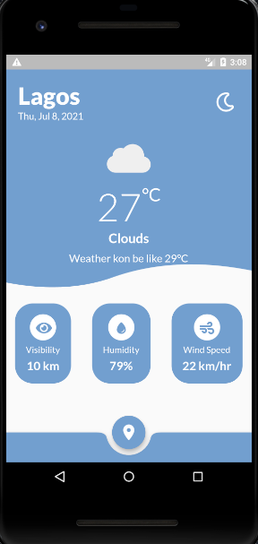
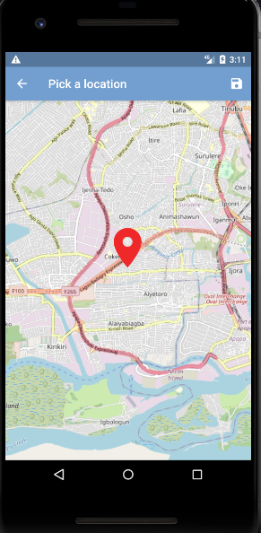
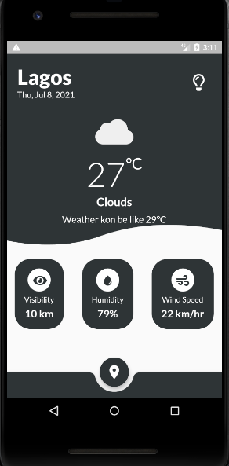

<h1 align="center">Welcome to Flutter Weather 👋</h1>

> Weather App Built with Flutter and OpenWeatherMap API

## Screenshots

#### The home page 


#### The Location Selection Page


#### The Dark Mode


[Download APK](https://github.com/majorsigma/weather-app/blob/master/build/app/outputs/apk/release/app-arm64-v8a-release.apk)

## Getting Started

To get a local copy up and running follow these simple example steps.

Prerequisite: https://flutter.dev/docs/get-started/install

1. To get started, fork this repository to your GitHub account.

2. Clone the repo.
    ```sh
     git clone https://github.com/majorsigma/weather-app
    ```
3. Install packages.
    ```sh
     flutter pub get
    ```
4. Add OpenWeatherMap API KEY on lib/screens/Loading.dart
  ```dart
  String apiKey = "<ADD API KEY HERE>";
  ```

5. Run project.
    ```sh
     flutter run
    ```
    
## Show your support

Give a ⭐️ if this project helped you!

## 📝 Credits

Credit to: [Hanzla Tauqeer](https://github.com/1hanzla100).<br />

## 📝 License

This project is [GPL-3.0](https://github.com/majorsigma/weather-app) licensed.<br />

Copyright © 2021 [Olalekan Ogundele](https://github.com/majorsigma)
